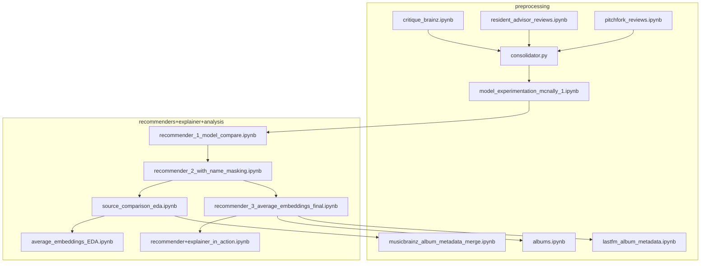

# Notebook catalog & reorganization plan

Catalog of what each notebook in `preprocessing/`, `model_experimentation/`, and
`recommenders+explainer+analysis/` does, what it reads and writes, plus a suggested
folder reorganization.

**Important context:** Many notebooks in `recommenders+explainer+analysis` were written
for Google Colab and write to `DRIVE_DIR = "/content/drive/MyDrive/Colab Notebooks"`.
In this repo, some of those artifacts already live under `datasets/`. When organizing,
treat Colab paths as the logical output names.

---

## Suggested pipeline order



---

## `preprocessing/`

| File | What it does | Inputs | Outputs |
|------|----------------|--------|---------|
| **`pitchfork_reviews.ipynb`** | Loads Pitchfork reviews from a local SQLite DB, cleans text/metadata | External: `data.sqlite3` | `datasets/pitchfork_reviews_cleaned.csv` |
| **`resident_advisor_reviews.ipynb`** | Loads RA reviews from a local CSV, cleans text/metadata | External: `resident-advisor.csv` | `datasets/resident_advisor_reviews_cleaned.csv` |
| **`critique_brainz.ipynb`** | Fetches CritiqueBrainz reviews via API, cleans/filters them | CritiqueBrainz API | `datasets/critique_brainz_reviews_cleaned.csv` (optional raw: `critique_brainz_reviews_raw.csv`) |
| **`consolidator.py`** | Merges the three cleaned source CSVs into one canonical review table | `*_reviews_cleaned.csv` from above | `datasets/merged_dataset.csv`, optionally `datasets/merged_dataset_sampled_49MiB.csv` if merged file > 49 MiB |
| **`model_experimentation_mcnally_1.ipynb`** | **Two jobs in one notebook:** (1) cleans/merges reviews, (2) compares embedding models and builds masked text via MusicBrainz personnel | `merged_dataset.csv` | `merged_dataset_cleaned.csv`, `merged_dataset_cleaned.parquet`, `merged_dataset_masked.parquet` |
| **`musicbrainz_album_metadata_merge.ipynb`** | Queries local MusicBrainz Postgres for release metadata/genres and joins to album catalog | `album_catalog.parquet` | `datasets/album_catalog_enriched.parquet` |
| **`albums.ipynb`** | Builds deduplicated album list from merged reviews; maps embedding recs to `album_id` edges for benchmarking | `merged_dataset.csv`, `recommendations_album_level_avg_embeddings.parquet` | `datasets/recommendations_from_to.csv` only (builds `unique_albums` in memory but does **not** save `albums.csv`) |
| **`lastfm_album_metadata.ipynb`** | Enriches the album catalog with MusicBrainz/Pitchfork metadata + Last.fm listeners/tags; joins those onto final recommendations | Existing `albums.csv`, `album_catalog_enriched.parquet`, `lastfm_recommendations_all_top_listener.csv`, `recommendations_album_level_avg_embeddings.parquet` | `datasets/albums.csv` (refreshed), `datasets/final_recs.parquet` |

### Notes on `preprocessing/`

- `albums.ipynb` intro says it “outputs benchmark subsets,” but the only saved file is
  `recommendations_from_to.csv`. The base `albums.csv` catalog appears to be created
  elsewhere (likely manual export from `unique_albums` at some point), then maintained
  by `lastfm_album_metadata.ipynb`.
- `model_experimentation_mcnally_1.ipynb` is really **preprocessing + model selection**
  bundled together. You may want to split or rename it when reorganizing.

---

## `model_experimentation/`

| File | What it does | Inputs | Outputs |
|------|----------------|--------|---------|
| **`model_experimentation_mcnally_1.ipynb`** | Same notebook as above — see preprocessing section | `merged_dataset.csv` | `merged_dataset_cleaned.csv`, `merged_dataset_cleaned.parquet`, `merged_dataset_masked.parquet` |

### What the “Model Exploration” half does (no separate artifact files)

Inside that notebook, after cleaning:

1. Builds `input_with_prefix` / `input_no_prefix` review text variants
2. Creates cross-source evaluation pairs (same album, different review source)
3. Benchmarks TF-IDF and several embedding models (Recall@k, MRR)
4. Queries MusicBrainz for album personnel
5. Creates `cleaned_text_masked` by replacing artist/producer names with `[MASKED]`

The embedding `.npy` files are produced later in the recommender notebooks, not here.

---

## `recommenders+explainer+analysis/`

These notebooks form the recommendation pipeline. Numbered `recommender_*` notebooks
are sequential; the EDA notebooks analyze choices made along the way.

| File | What it does | Inputs | Outputs |
|------|----------------|--------|---------|
| **`recommender_1_model_compare.ipynb`** | Compares embedding models (MiniLM, E5-large, Nomic) on cleaned and masked text; includes explainer prototypes | `merged_dataset_cleaned.parquet`, `merged_dataset_masked.parquet` | Many `.npy` embedding files on Drive, e.g. `nomic_with_prefix_clean.npy`, `nomic_no_prefix_clean.npy`, `minilm_masked_with_prefix.npy`, `e5_large_masked_with_prefix.npy`, etc. **No parquet recs.** |
| **`recommender_2_with_name_masking.ipynb`** | Re-embeds corpus with personnel-masked text using Nomic; builds a masked review-level recommender + keyword overlap preview | `merged_dataset_masked.parquet` | `nomic_masked_with_prefix.npy`, `nomic_masked_no_prefix.npy` |
| **`source_bias_analysis_+_pitchfork_recommendations.ipynb`** | Earlier Pitchfork-focused source-bias diagnostic; generates PF-only recommendations and EDA plots | `merged_dataset_masked.parquet`, `nomic_masked_with_prefix.npy` | `recommendations_pitchfork_only.parquet`, PNGs: `eda_1_scores.png` … `eda_7_reciprocity.png` |
| **`source_comparison_eda.ipynb`** | **Main source-bias study** — runs recommenders under 3 candidate pools (PF-only, PF+RA, all sources), EDA, hidden gems, album catalog | `merged_dataset_masked.parquet`, `nomic_masked_with_prefix.npy` | `recommendations_pitchfork_only.parquet`, `recommendations_pitchfork_ra.parquet`, `recommendations_all_sources.parquet`, `hidden_gems_ra.parquet`, `hidden_gems_cb.parquet`, `album_catalog.parquet`, EDA PNGs (`eda_all_*.png`, `eda_part2_1_overlap.png`) |
| **`average_embeddings_EDA.ipynb`** | Analyzes whether averaging embeddings across sources shifts results vs Pitchfork-only; tests review-length confound | `merged_dataset_masked.parquet`, `nomic_masked_with_prefix.npy` | **Analysis only** — no saved datasets |
| **`recommender_3_average_embeddings_final.ipynb`** | **Final recommender** — averages masked review embeddings to album level, generates full rec database, Billboard subset, recommendation chains | `merged_dataset_masked.parquet`, `nomic_masked_with_prefix.npy` | `album_embeddings_masked.npy`, `album_keys_masked.parquet`, `recommendations_album_level_avg_embeddings.parquet`, `billboard_top10_recommendations_for_comparison.parquet/.csv`, `recommendation_chains_all_albums.parquet` |
| **`recommender+explainer_in_action.ipynb`** | Interactive demo: top-k recs + LLM explainer on real query albums | `recommendations_album_level_avg_embeddings.parquet`, `merged_dataset_masked.parquet` | **Demo only** — no files saved |

### Key artifacts already in `datasets/`

| File | Likely producer |
|------|-----------------|
| `merged_dataset_cleaned.csv` | `model_experimentation_mcnally_1.ipynb` |
| `recommendations_all_sources.parquet` | `source_comparison_eda.ipynb` |
| `album_catalog_enriched.parquet` | `musicbrainz_album_metadata_merge.ipynb` |
| `albums.csv` | `lastfm_album_metadata.ipynb` (enriched refresh) |
| `final_recs.parquet` | `lastfm_album_metadata.ipynb` |

---

## Suggested reorganization

```
preprocessing/
  01_sources/
    pitchfork_reviews.ipynb
    resident_advisor_reviews.ipynb
    critique_brainz.ipynb
  02_merge/
    consolidator.py
  03_clean/
    model_experimentation_mcnally_1.ipynb   # or split into clean + model-select
  04_catalog/
    albums.ipynb
    musicbrainz_album_metadata_merge.ipynb
    lastfm_album_metadata.ipynb

model_experimentation/
  # either move the model-selection half here from mcnally notebook,
  # or keep as a pointer/README to that section

recommenders+explainer+analysis/
  01_model_selection/
    recommender_1_model_compare.ipynb
    recommender_2_with_name_masking.ipynb
  02_source_bias/
    source_comparison_eda.ipynb              # keep
    source_bias_analysis_+_pitchfork_recommendations.ipynb  # archive/superseded?
  03_final_recommender/
    average_embeddings_EDA.ipynb
    recommender_3_average_embeddings_final.ipynb
  04_demo/
    recommender+explainer_in_action.ipynb
```

### Likely duplicates / archive candidates

- **`source_bias_analysis_+_pitchfork_recommendations.ipynb`** looks superseded by
  **`source_comparison_eda.ipynb`** (broader, generates all three rec pools + catalog).
- **`model_experimentation/`** currently has only one notebook that duplicates work
  also described under preprocessing.
